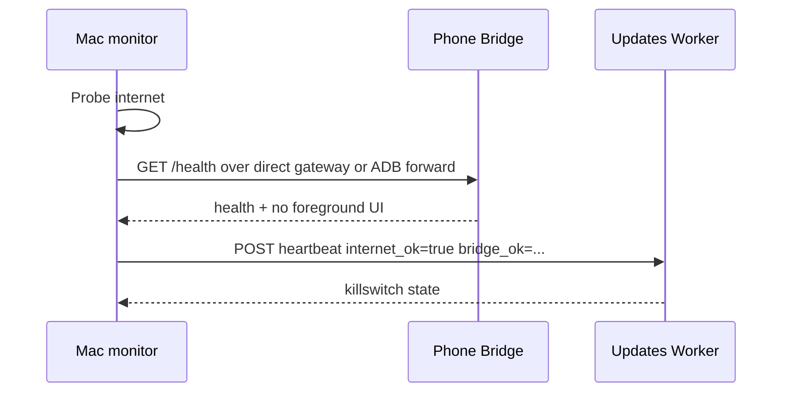
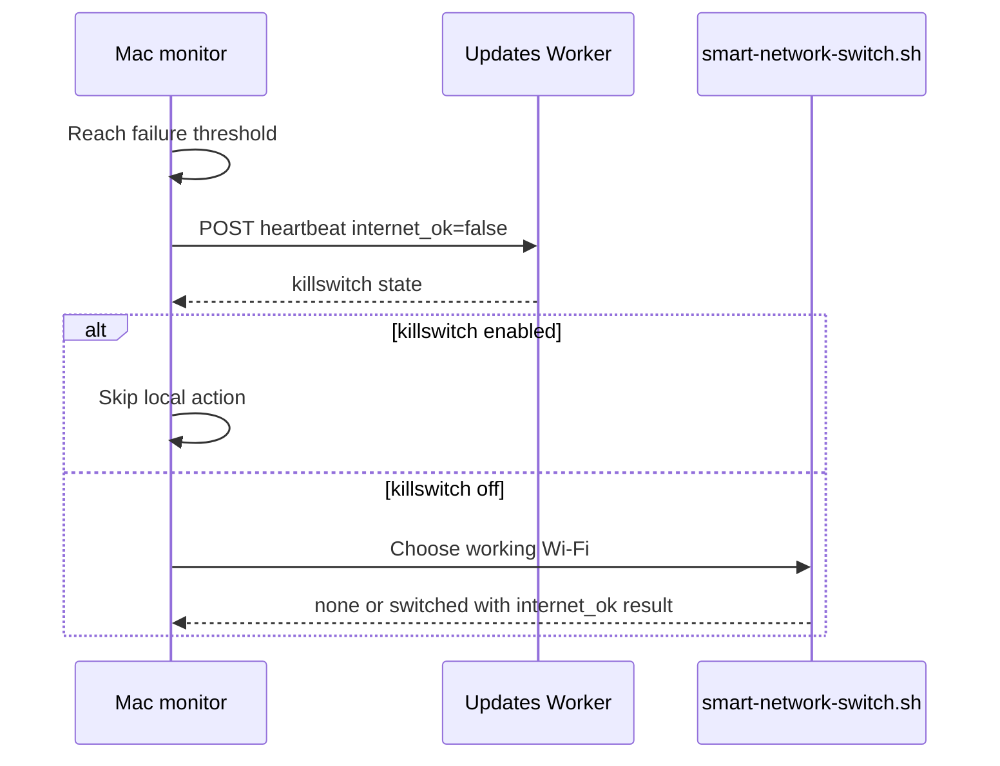
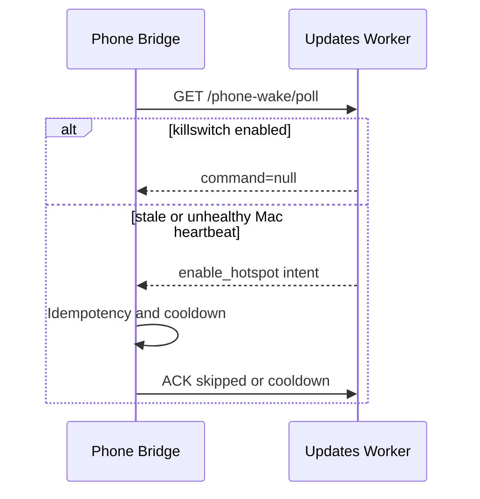
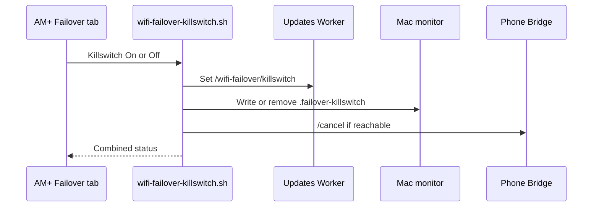

# Bridge Failover Handoff

## Current State

The standalone WiFi Failover Android app is retired. Phone-side behavior now
belongs to Bridge, installed as:

```text
tech.ainorthstar.usagepush
```

The deleted standalone package was:

```text
com.wififailover.app
```

This repo now only contains the Mac-side local monitor:

```bash
scripts/local-failover-monitor.sh
```

The user LaunchAgent for the moved repo is:

```text
~/Library/LaunchAgents/tech.ainorthstar.wifi-failover-monitor.plist
```

## Active Path

Bridge hosts a local HTTP status/control server on the phone at port `38788`:

- `GET /health`
- `GET /enable-hotspot`
- `GET /enable-tailscale`
- `GET /cancel`

The Mac helper checks direct Bridge URLs first, including the current default
gateway `http://<gateway>:38788` when the Mac is already joined to the phone
hotspot. It then falls back to known host:port ADB serials, forwards Bridge over
ADB, refreshes Bridge `/health` while internet is still healthy, posts one
accurate unhealthy heartbeat after repeated ping failures, then runs
`scripts/smart-network-switch.sh` to keep the current Wi-Fi if it has internet
or switch macOS Wi-Fi to the saved SSID `Dhruv's Phone`. It tries all known
main-phone paths before declaring Bridge unavailable: the LaunchAgent serial,
`MAIN_PHONE_ADB_SERIAL`,
the local Tailscale relay at `127.0.0.1:$MAIN_PHONE_LOCAL_ADB_PORT`, and
`$MAIN_PHONE_LOCAL_WIFI_IP:$MAIN_PHONE_WIRELESS_ADB_PORT`. There is no
Cloudflare Worker, Android build, Python daemon, or launchd installer in this
repo now.

The monitor treats recovery as sustained only after
`WIFI_FAILOVER_RECOVERY_THRESHOLD` consecutive successful checks, and it applies
`WIFI_FAILOVER_ACTION_COOLDOWN_SECONDS` between failover actions. This prevents
one flapping outage from repeatedly switching networks or posting synthetic
phone intents.

This flow only works if the Mac can still reach Bridge locally after internet
loss. It covers upstream/WAN failure while LAN/ADB remains available, and direct
Bridge over the hotspot gateway covers the already-on-hotspot case. ADB relay is
optional control only, not required for failover.

Cloudflare can be used as an out-of-band command mailbox, but only from a
network that still works. Bridge already polls:

```text
https://updates.ainorthstar.tech/phone-wake/poll?phone_id=<phone_id>
```

and accepts `enable_hotspot` commands queued through:

```text
POST https://updates.ainorthstar.tech/phone-wake/request
```

The Worker-side stale Mac heartbeat detector is implemented in the deployed
updates Worker. The Mac monitor POSTs `/wifi-failover/heartbeat`; when Bridge
polls `/phone-wake/poll?phone_id=<phone_id>` and the heartbeat is stale or
reports `internet_ok=false`, the Worker returns a synthetic `enable_hotspot`
command and records Bridge ACKs at `/phone-wake/ack`. Bridge now treats hotspot
and Tailscale commands as idempotent phone-side decisions and does not launch
Settings, Tailscale, or an overlay window from failover.

The local monitor does not request Tailscale while the Mac is already failing
its internet check. Wake settings are sourced from parent repo `.env` and
`.main-phone-remote.env`. It also derives the heartbeat URL from the configured
wake request URL unless `WIFI_FAILOVER_HEARTBEAT_URL` is set.

Emergency killswitch is coordinated by the failover utility script:

```bash
scripts/wifi-failover-killswitch.sh on "overtriggering"
```

Run `scripts/wifi-failover-killswitch.sh off` to re-arm failover, and
`scripts/wifi-failover-killswitch.sh status` to check the state. It controls:

- Worker killswitch: suppresses queued and synthetic phone wake commands.
- Mac local state: `wifi-failover-utility/.failover-killswitch`; monitor idles
  immediately while this file exists.
- Phone Bridge: calls `/cancel` when reachable.

## Current Sequences

### Mac Monitor Healthy Path



### Internet Failure Path



### Phone Worker Poll Path



### AM+ Killswitch Path



## Invalidated Scenarios

- Mac monitor must not call Bridge `/enable-hotspot` as a failover action.
- Bridge failover paths must not open Settings, Tailscale, or an overlay window.
- ADB relay must not be treated as required for failover.
- AM+ must not expose a one-way killswitch; it needs On, Off, and Status.

## Verified Before Cleanup

Main phone:

```text
192.168.0.110:5555 product:CPH2573IN model:CPH2573
```

Bridge health endpoint through direct hotspot gateway:

```json
{"ok":true,"app":"Bridge","mode":"local","port":38788,"foreground_ui_enabled":false,"hotspot_silent_control":false}
```

Bridge hotspot request path is now idempotent and non-foreground:

```bash
curl http://10.39.101.198:38788/enable-hotspot
scripts/smart-network-switch.sh
```

Observed responses showed the first hotspot command returned
`silent_hotspot_unavailable`, the second returned `cooldown`, and the foreground
window did not change.

## Manual Root Cleanup

An old system LaunchDaemon may still exist from earlier experiments. Codex
should not run sudo commands. If it exists, D should remove it manually:

```bash
sudo launchctl bootout system /Library/LaunchDaemons/com.dhruvanand.wifi-failover.plist
sudo rm -f /Library/LaunchDaemons/com.dhruvanand.wifi-failover.plist
```

## Resume

```bash
adb devices -l
export WIFI_FAILOVER_PHONE_SERIAL=192.168.0.110:5555
scripts/local-failover-monitor.sh
```
