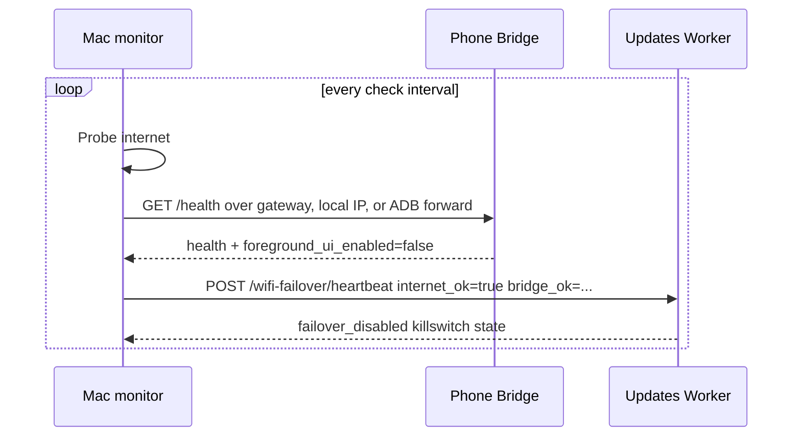
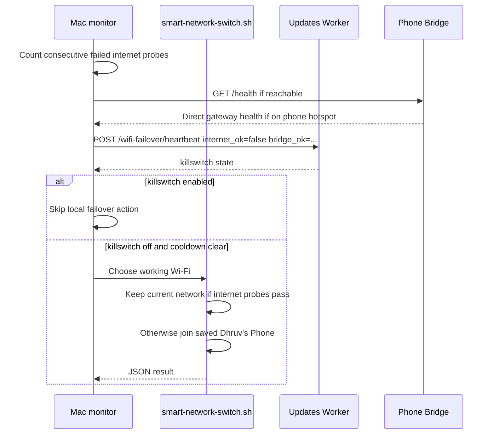
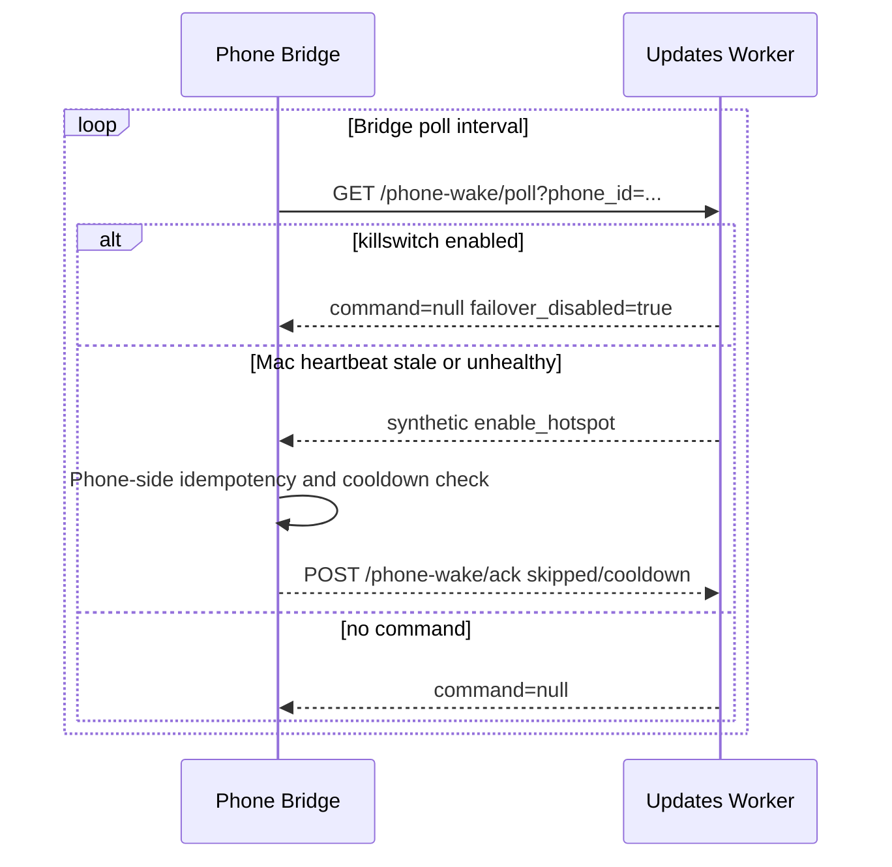
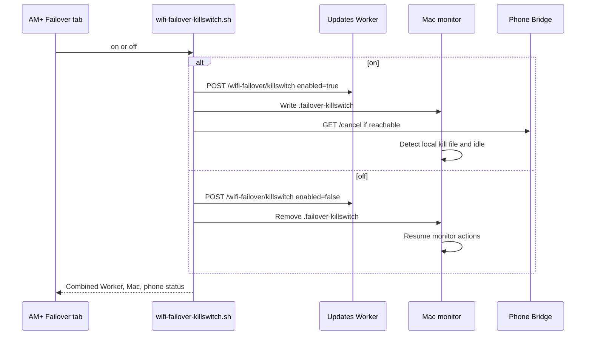

# Bridge Failover Monitor

Mac-side connectivity watcher for Bridge.

This repo no longer builds or ships a standalone Android app. The phone-side
hotspot and Tailscale controls live in the existing Bridge app package:

```text
tech.ainorthstar.usagepush
```

Bridge exposes a local HTTP status/control server on the phone at port `38788`.
This repo only keeps the Mac helper that reports internet health and chooses a
working Mac Wi-Fi path. It does not ask the phone to launch hotspot or Tailscale
foreground UI.

## Decisions

- The Mac is a health reporter and network selector, not a phone UI controller.
- Bridge owns phone-side failover decisions and keeps them idempotent with
  cooldowns. In the current normal app build, silent hotspot control is not
  available, so Bridge acknowledges hotspot intent as skipped/cooldown without
  opening Settings.
- Direct Bridge over the hotspot gateway is the preferred local control path
  when the Mac is already connected to the phone hotspot.
- ADB relay is optional inspection/control. Failover must not depend on relay
  stability.
- AM+ is the operator surface. Its killswitch controls Worker queue/synthetic
  commands, a Mac local state file, and Bridge `/cancel` when the phone is
  reachable.
- Bluetooth PAN can be considered later as another local network path, but no
  manual Bluetooth toggling or foreground UI automation is part of the current
  failover design. NFC is out of scope.

## Requirements

- Bridge installed and running on the Android phone.
- ADB connected to the phone over USB or wireless debugging.
- The fallback hotspot SSID saved in macOS preferred Wi-Fi networks if automatic
  Mac-side switching is desired.

## Run

For the main phone:

```bash
export WIFI_FAILOVER_PHONE_SERIAL=192.168.0.110:5555
scripts/local-failover-monitor.sh
```

The script:

1. Checks direct Bridge URLs first, including the current default gateway
   `http://<gateway>:38788`. This covers the case where the Mac is already
   joined to the phone hotspot.
2. Falls back to forwarding `127.0.0.1:38788` to Bridge over ADB.
3. Tries all known main-phone ADB candidates before declaring Bridge
   unavailable: `WIFI_FAILOVER_PHONE_SERIAL`, `MAIN_PHONE_ADB_SERIAL`,
   `127.0.0.1:$MAIN_PHONE_LOCAL_ADB_PORT`, and
   `$MAIN_PHONE_LOCAL_WIFI_IP:$MAIN_PHONE_WIRELESS_ADB_PORT`.
4. Runs `adb connect` for host:port serials before forwarding, so a known
   Wi-Fi or local Tailscale relay endpoint is actively attached instead of only
   assumed present.
5. Refreshes Bridge `/health` while internet is still healthy, so the local
   ADB path is already warm before an outage.
6. Sends token-authenticated heartbeat state to
   `https://updates.ainorthstar.tech/wifi-failover/heartbeat`.
   The Worker can synthesize `enable_hotspot` from stale or unhealthy
   heartbeats when Bridge polls over phone data.
7. Pings `8.8.8.8` every 5 seconds.
8. After 3 failures, posts one accurate unhealthy heartbeat and runs
   `scripts/smart-network-switch.sh`.
9. Keeps the failover action armed until 6 consecutive successful checks, and
   applies a 15 minute action cooldown so a flapping link does not repeatedly
   switch networks during one outage.
10. Does not send `enable_tailscale` while the Mac is failing its internet
   check; ADB relay is optional control only.
11. Keeps the current Wi-Fi if it has internet, otherwise tries the saved Wi-Fi
   network `Dhruv's Phone` and only reports success if internet probes pass.

This works when the Mac can either keep its current network or join the already
available phone hotspot. Direct Bridge over the hotspot gateway is preferred.
ADB relay is useful for inspection/control, but not required for failover.

## Sequence Diagrams

### Healthy Pre-Arm



### Mac Internet Failure



### Phone Polls Worker



### AM+ Killswitch



## Cloud Command Path

Bridge already polls the updates Worker wake queue. A remote command can enqueue
hotspot intent while the phone still has cellular data:

```bash
curl -fsS -X POST https://updates.ainorthstar.tech/phone-wake/request \
  -H "authorization: Bearer $PHONE_USAGE_INGEST_TOKEN" \
  -H "content-type: application/json" \
  -d '{"phone_id":"main","action":"enable_hotspot"}'
```

The deployed Worker also supports the autonomous stale-heartbeat path: the Mac
monitor POSTs heartbeat state, Bridge polls
`/phone-wake/poll?phone_id=<phone_id>`, and the Worker returns a synthetic
`enable_hotspot` command if the Mac heartbeat is stale or reports
`internet_ok=false`. Bridge now treats that command as a phone-side idempotent
decision and will not open Settings or foreground Tailscale.

Emergency killswitch:

```bash
scripts/wifi-failover-killswitch.sh on "overtriggering"
```

Reset it with `scripts/wifi-failover-killswitch.sh off`, and check it with
`scripts/wifi-failover-killswitch.sh status`. When enabled, the script sets the
Worker killswitch, writes the Mac local kill file, and calls Bridge `/cancel`
when reachable. The Worker suppresses queued and synthetic phone wake commands,
and the Mac monitor skips local failover actions immediately while the local
kill file exists.

## LaunchAgent

The repo ships a user LaunchAgent at:

```text
launchd/tech.ainorthstar.wifi-failover-monitor.plist
```

It runs the same monitor from the moved `phone-debug` location and writes logs
under `wifi-failover-utility/logs/`.

## Configuration

```bash
WIFI_FAILOVER_PHONE_SERIAL=192.168.0.110:5555
WIFI_FAILOVER_PORT=38788
WIFI_FAILOVER_CHECK_HOST=8.8.8.8
WIFI_FAILOVER_CHECK_INTERVAL=5
WIFI_FAILOVER_FAILURE_THRESHOLD=3
WIFI_FAILOVER_RECOVERY_THRESHOLD=6
WIFI_FAILOVER_ACTION_COOLDOWN_SECONDS=900
WIFI_FAILOVER_HOTSPOT_SETTLE_SECONDS=8
WIFI_FAILOVER_WAKE_RETRY_SECONDS=120
WIFI_FAILOVER_HEARTBEAT_INTERVAL=10
WIFI_FAILOVER_MAC_ID=dhruvs-macbook-pro-2
```

The wake webhook is sourced from the parent repo's `.env` and
`.main-phone-remote.env` by default:

```bash
MAIN_PHONE_WAKE_WEBHOOK_URL=https://updates.ainorthstar.tech/phone-wake/request
MAIN_PHONE_WAKE_WEBHOOK_TOKEN=...
MAIN_PHONE_WAKE_PHONE_ID=cph2573
```

If `WIFI_FAILOVER_HEARTBEAT_URL` is unset, the monitor derives it from
`MAIN_PHONE_WAKE_WEBHOOK_URL` by replacing `/phone-wake/request` with
`/wifi-failover/heartbeat`.

## Manual Checks

```bash
adb -s 192.168.0.110:5555 forward tcp:38788 tcp:38788
curl http://127.0.0.1:38788/health
curl http://127.0.0.1:38788/enable-hotspot
scripts/smart-network-switch.sh
scripts/wifi-failover-killswitch.sh status
```

Expected health response:

```json
{"ok":true,"app":"Bridge","mode":"local","port":38788,"foreground_ui_enabled":false,"hotspot_silent_control":false}
```

## Removed

The old standalone `com.wififailover.app`, Cloudflare Worker heartbeat, Python
package, launchd daemon templates, APK build outputs, and Android project were
removed. Do not rebuild phone-side functionality here; add it to Bridge instead.
